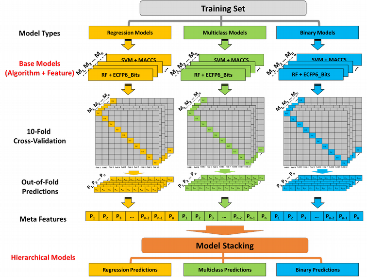
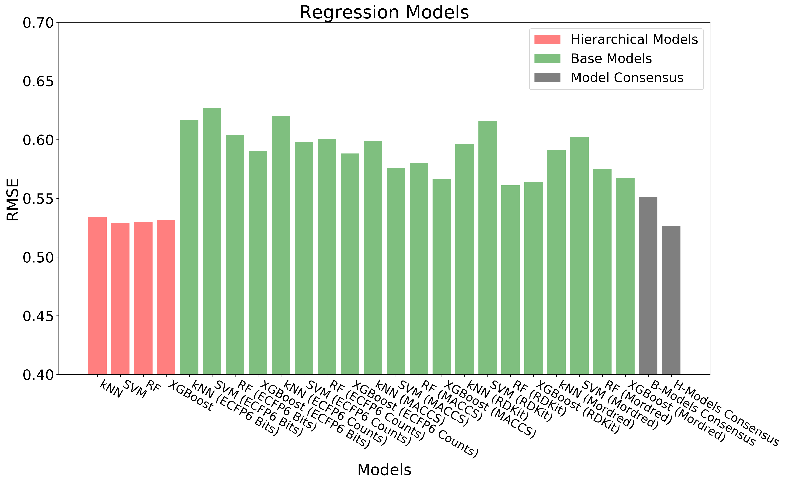
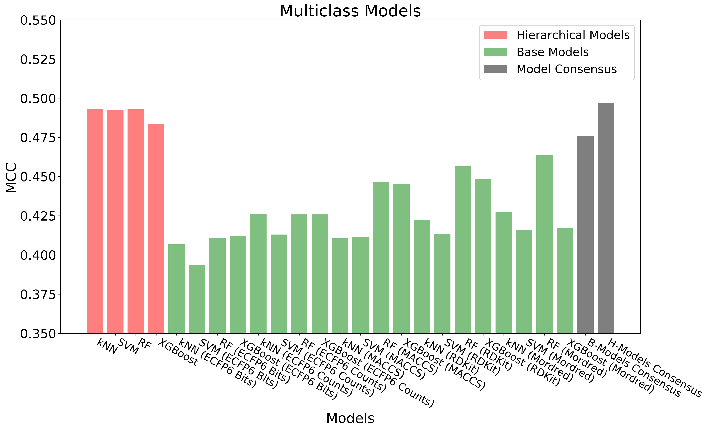

# Hierarchical-QSAR-Modeling
Implementation of **Hierarchical H-QSAR Modeling Approach for Integrating Binary/Multi Classification and Regression Models of Acute Oral Systemic Toxicity**

<span style="display:block;text-align:center"></span>

The above figure shows the overall workflow for building `hierarchical QSAR models`. Base regression, binary and multiclass models (60 models in total) are built with diverse combinations of machine learning algorithms and chemical descriptors/fingerprints. **Out-of-Fold Predictions** of base models are generated through 10-fold cross-validation. The out-of-fold predictions are concatenated together and used as input (Meta Features) for building hierarchical regression, binary and multiclass models.

## Data
The **rat acute oral toxicity data** used in this study were collected by the National Toxicology Program Interagency Center for the Evaluation of Alternative Toxicological Methods (NICEATM) and the U.S. EPA National Center for Computational Toxicology (NCCT) from a number of public available datasets and resources. The full description and the actual dataset is available at [here](https://ntp.niehs.nih.gov/go/tox-models). The whole dataset, comprising 11,992 compounds, was semi-randomly split into a training set (75%) and an external test set (25%) with equivalent coverage with respect to LD50 distribution by the organizers of the project. 

The **curated training and test data** are avaiable in [train_test_sets](https://github.com/XinhaoLi74/Hierarchical-QSAR-Modeling/tree/master/data/train_test_sets) folder.

## Code

The code is provides as `Jupyter notebook` in the `notebooks` folder. All code was developed in a Ubuntu 18.04 workstation.

1. Prepare `labels` for modeling: [labels.ipynb](https://github.com/XinhaoLi74/Hierarchical-QSAR-Modeling/blob/master/notebooks/labels.ipynb).
### Base models
2. Compute chemical descriptors/fingerprints for base models: [descriptors.ipynb](https://github.com/XinhaoLi74/Hierarchical-QSAR-Modeling/blob/master/notebooks/descriptors.ipynb).
3. Descriptor Selection: [descriptors_selections.ipynb](https://github.com/XinhaoLi74/Hierarchical-QSAR-Modeling/blob/master/notebooks/descriptors_selections.ipynb).
4. Hyperparameter tuning of base models: [Base_models_selection.ipynb](https://github.com/XinhaoLi74/Hierarchical-QSAR-Modeling/blob/master/notebooks/Base_models_selection.ipynb).
5. Building base models with optimal hyperparameters: [Base_models.ipynb](https://github.com/XinhaoLi74/Hierarchical-QSAR-Modeling/blob/master/notebooks/Base_models.ipynb).
### Hierarchial Models
6. Meta features: [Hierarchical_features.ipynb](https://github.com/XinhaoLi74/Hierarchical-QSAR-Modeling/blob/master/notebooks/Hierarchical_features.ipynb).
7. Hyperparameter tuning of hierarchical models: [Hierarchical_models_selection.ipynb](https://github.com/XinhaoLi74/Hierarchical-QSAR-Modeling/blob/master/notebooks/Hierarchical_models_selection.ipynb).
8. Build hierarchial models with optimal hyperparameters: [Hierarchical_models.ipynb](https://github.com/XinhaoLi74/Hierarchical-QSAR-Modeling/blob/master/notebooks/Hierarchical_models.ipynb).
### Model Evaluation
9. Evaluate cross-validation and test set performance: [Model_evaluation.ipynb](https://github.com/XinhaoLi74/Hierarchical-QSAR-Modeling/blob/master/notebooks/Model_evaluation.ipynb).

## Results
<span style="display:block;text-align:center"></span>

<span style="display:block;text-align:center"></span>


<span style="display:block;text-align:center"></span>


## GUI

### Installation 

```shell
conda env create -f hqsar_env.yml
pip install streamlit
```

Run the GUI:

```shell
streamlit run GUI.py
```